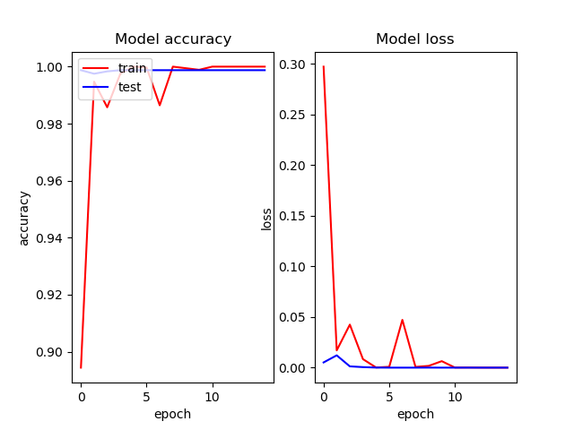
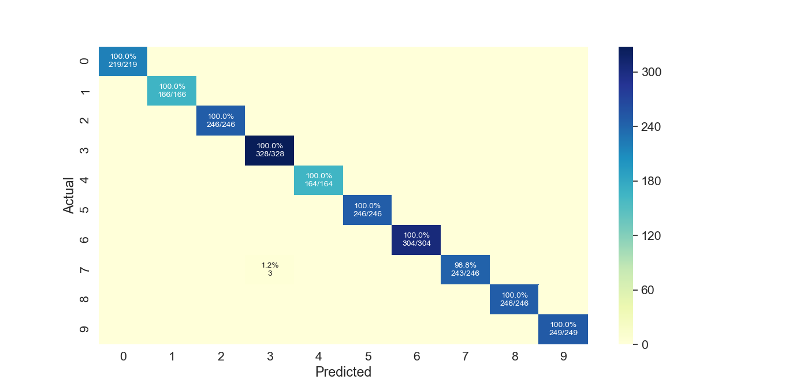

# Fruits images classification using Convolutional Neural Networks
> The aim of this project is to build a Convolutional Neural Networks (CNN) for fruits images classification. In 
> particular, the CNN developed for this project will attempt to predict a fruit or vegetable variety in a given photo.

## Table of contents
* [Data set](#data-set)
* [Technologies](#technologies)
* [Setup](#setup)
* [Status](#status)

## Data set
Images used to train neural nets are obtained from the the website [@www.kaggle.com/moltean/fruits](https://www.kaggle.com/moltean/fruits).
The fruits 360 data set on Kaggle consists of 82213 images of 120 fruits. In this project are included the following 
fruits: Apple Red Yellow 2, Banana Red, Cherry 2, Grape Blue, Lemon, Peach 2, Plum 3, Strawberry Wedge, Tomato 1 and 
Walnut.

Training set size: 7225 images

Validation set size: 2414 images

Number of classes: 10 (fruits):
* 0 - Apple Red Yellow 2
* 1 - Banana Red
* 2 - Cherry 2
* 3 - Grape Blue
* 4 - Lemon
* 5 - Peach 2
* 6 - Plum 3
* 7 - Strawberry Wedge
* 8 - Tomato 1
* 9 - Walnut

## Technologies
This project is created with:
* Python - version 3.7

## Setup
You need to copy images from the fruits data set into the project directory to train the model and place them into the 
data directory in fruits_train and fruits_test directories. 
  * data
      * fruits_test
      * fruits_train

You can also run the program without training, the best model is saved in the file: best_model.h5
To train the model you have to set a train variable in main.py as True, this will also plot a training history.

Create your virtualenv and install project requirements:
`pip install -r requirements.txt`
Run the main program with:
`python main.py`

## Model
I used convolutional layers with max pooling, fully connected layers and dropout. Similar models were used to image 
recognition problems. I followed the architecture and created model with almost 100 % accuracy.

Model layers are:
* Covolutional layer
* Max pooling
* Covolutional layer
* Max pooling
* Covolutional layer
* Max pooling
* Covolutional layer
* Max pooling
* Dropout
* Fully connected layer
* Fully connected with softmax activation

## Results
Model is trained and goes to 100 % accuracy. I am saving only the best fitted model with highest accuracy.
The results - training curves and testing done on test images are shown below.  
Results after training:  
Final training accuracy = 1.0  
Final training loss = 1.8126694522326195e-05  

  
The training process goes fastly and model reaches 100 % accuracy. The loss is reduced. There is no overfitting, 
because I am saving only the best model. 
  
As we can see my network is easily recognizing all of the fruits.

## Status
Project is: _finished_
